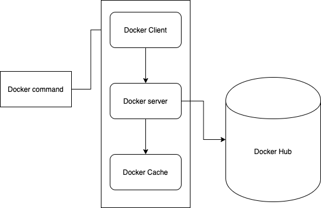

# Docker

## What and why docker

Docker is a platform or ecosystem around creating and running containers.

- **image**: single file with all deps and config required to run a program.
- **container**: instance of an image runs a program
- **namespacing**: isolating resources per process/group of process by hard-drive, network, user, hostname, etc.
- **control groups**: limit amound of resouce usned per process. E.g memory, cpu, io...

Containers is a running image with group of resources assigned to it. Docker server is running in Linux OS. Containers have fully isolated storages by default.

Image contains File snapshot and a startup command. Firstly the file snapshot will be copied to assigned harddisk, and process will be executed by the startup command based on allocated resource to the image.

naming spaces and control groups are concepts of Linux system.

Dockers makes it easy to install and run software without worrying about setup or dependencies

Docker is a tool in normal development flow.

## Docker environment setup

**Docker client** -> **Docker Daemon**

## Docker workflow

Docker client will send request to docker server, and server may retrieve image from local cache or remote docker hub.



Command which are executable are based on the file system of the container.

## Docker commands

- docker run busybox = `docker create` and `docker start`
  - -p route incoming request to this port on localhost to a port inside container. `docker run -p 8080 : 8080 imagename`. Port mapping is a runtime config rather than build time config
  - -v $(pwd):/app: map reference of `pwd` path to `:/app` folder.
- docker ps
  - -`v /app/node_modules` (exclude the mapping)
  - --all (return containers with more status)
- docker create: create a containers, copy file copy from image to file system. Return a docker container id.
- docker start: execute the primary `start command` of the images
  - -a: attached STDOUT/STDERR.
- docker system prune: clean stopped containers and build cache
- docker logs [containerId]
- docker stop: stop container smoothly, it takes more time to shut down
- docker kill: shut down immediately
- docker exec -it [container id] command sh
  - -it: exec into the running container by hooking up your console to STDIN and STDOUT stream of the container.
    - -i: attached input to STDIN
    - -t: show output to terminal
  - sh/bash/powershell/zsh: open up one kind of executable shell terminal of container
- docker build: build docker image based on Dockerfile
  - -t [your docker id / your project name : version] .
  - -f specify the docker config file for the docker build
  e.g.  

    ```bash
    docker build berichge/elasticsearch:latest .
    docker run berichge/elasticsearch:latest
    ```

## Build customzied images

Dockerfile -> Docker Client -> Docker Server -> Usable image

### Dockerfile

Basic imsage -> install addition programs - specify startup command

Key words in Docker file

- FROM
- RUN
- CMD
  - CMD vs Entrypoint
- COPY [path on your machine relative to build context] [path in image, it can be path relative current working path e.g. `./`]
  - note: be aware of unnecessary lib file in same path which may slow down the docker build process
  - note: isolate the copy of dependencies and code file to avoid unnecessary rebuilds
- WORKDIR: defined user default work directory, for hosting all customzied files copied to the image.

#### Base image

An initial setup of program/OS. `alpha` is a preinstalled set of program that useful to user. `alpha` has installed package management program `apk`.

#### Building workflow

Docker builds new images based on each commands by adding new dependencies on previous built image. Docker uses temporary containers during the build workflow.

Docker is able to fetch images from cache based on previous built image.

Those factors guarantee the performance of docker build

Also, docker can use `commit` command to add layer based on image.

## Docker compose

Docker compose is a cli to combine multiple docker commands and automatic steps. Compose file can setup internal networking between all containers listed in config file.

`docker-compose up --build`

other commands
docker-compose

- up:
  - -d run in daemon
  - --build
- down: kill all containers
- ps: read the config file and try to find all running containers.

### restart policy

    services:
        node-app:
            restart: always/"no"/on-failure/unless-stopped

## Docker resources

[Docker hub](https://hub.docker.com/search?q=&type=image) : use `FROM reponame:tag` to install basic package of image
